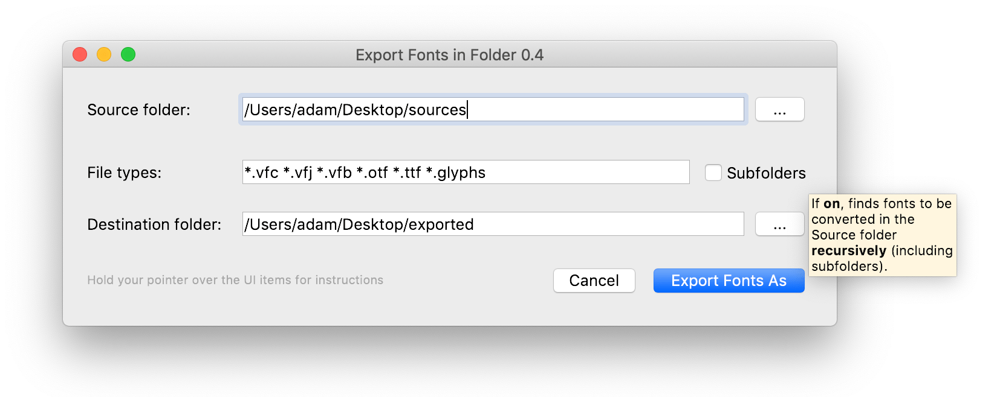

# twardoch-fontlab-scripts

- Python scripts for [FontLab 7](http://fontlab.info)
- by Adam Twardoch
- Licensed at your choice under:
  - [CC-0](./LICENSE) (public domain)
  - MIT license, Copyright © 2020 Adam Twardoch

## Installation

1. Download and unzip [twardoch-fontlab-scripts-master.zip](https://github.com/twardoch/twardoch-fontlab-scripts/archive/master.zip). Then:
2. With Finder or File Explorer, go inside the `Script` subfolder that is inside the unzipped folder.
3. In another Finder or File Explorer window, go to your FontLab 7 [user data folder](https://help.fontlab.com/fontlab/7/manual/Custom-data-files-and-locations/#user-data-folder). Unless you have picked a custom location in _Preferences > General > User data folder_, it’s:
   - on macOS: `~/Library/Application Support/FontLab/FontLab 7` where `~` is your home folder
   - on Windows: `%userprofile%\AppData\Roaming\Fontlab\Fontlab 7` where `%userprofile%` is your home folder
4. If there is no `Scripts` folder inside your user data folder, create it.
5. Copy the contents of the unzipped `Scripts` folder into the `Scripts` folder in your user data folder.
6. Run FontLab 7, or if it’s running, choose _Scripts > Refresh Scripts_

**Note:** This is not an official Fontlab Ltd. product. No technical support, no warranty whatsoever — but pull requests are welcome.

## Usage

Open a font and run the scripts from the _Scripts_ menu.

### TW Export Fonts > Export Fonts in Folder

1. In FontLab 7, choose **Scripts > TW Export Fonts > Export Fonts in Folder**
2. Choose the **Source folder** where you have your source `.vfc`, `.vfj`, `.vfb`, `.otf`, `.ttf` etc. (defaults to folder in which the currently open font is saved).
3. Specify which font types you’d like to convert, and whether the script should also recursively search in the subfolders of the Source folder.
4. Choose the **Destination folder** in which the exported fonts will be written.
5. Click **Export Fonts As**, choose (and customize if needed) the export **Profile** (format and settings), and choose **Content** that you want to export (Current layer, Instances or Masters). _Don’t change the Destination settings, they’re special._ Click **Export**.
6. The script looks for all the source fonts, opens each one and exports with your settings.
   - If you turned on Subfolders, it’ll replicate the subfolder structure in the Destination folder.
   - If a font is exported as one file (e.g. OpenType PS .otf with Current layer setting), the base filename of the source file will be used as the name of the exported file.
   - If a font is exported as multiple fonts file (Masters, Instances, color fonts or web fonts), the base filename of the source file will be used as the name of a subfolder, and the exported files will be written inside that subfolder.

### TW Glyph Names and Unicode > Generate Unicodes by NAM

1. In FontLab 7, open a font and choose **Scripts > TW Glyph Names and Unicode > Generate Unicodes by NAM**
2. Choose a Unicode-to-glyphname [NAM mapping file](https://help.fontlab.com/fontlab/7/manual/Custom-data-files-and-locations/#glyph-name-to-unicode-mapping-rules-standardnam) (with `.nam` file extension) that contains your custom Unicode-to-glyphname assignments (for example, “double-encoding”)
3. Choose whether the script should flag (color-mark) the glyphs in which it changed Unicode codepoints, and whether it should keep Unicodes for glyphs not covered by the NAM (otherwise it’ll unencode those glyphs)
4. Click **Generate Unicodes** to re-generate Unicodes in all glyphs in the font based on the NAM file.

As a separate functionality, you can also open a font, run the script and click **Save NAM file**. This will contain the Unicode-to-glyphname mapping of the current font.

