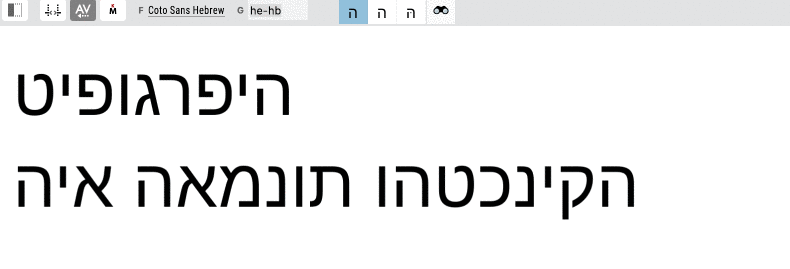

# twardoch-fontlab-scripts

**Useful Python scripts for [FontLab 7](http://fontlab.info) by Adam Twardoch.**

These scripts are designed to streamline your font design workflow, automate common tasks, and extend the capabilities of FontLab 7. They are provided under a permissive license, allowing for wide use and modification.

**License:** Licensed at your choice under:
  - [CC-0](./LICENSE) (public domain)
  - MIT license, Copyright © 2020 Adam Twardoch

## Part 1: General Information

This section is for all users, including those who may not be deeply technical. It covers what the scripts do, who they're for, why they're useful, and how to install and use them.

### What are these scripts?

This repository contains a collection of Python scripts that add new functionalities to FontLab 7. Each script addresses a specific task in the font production process, such as batch exporting fonts, managing Unicode assignments, selecting glyphs based on criteria, or manipulating text in the Glyph window.

### Who are these scripts for?

These scripts are primarily for:

*   **Font Designers:** Professionals and hobbyists who use FontLab 7 for creating and editing fonts.
*   **Typographers:** Individuals working with type who might need to perform specific batch operations or analyses on fonts.
*   **FontLab Users:** Anyone looking to enhance their FontLab 7 experience with custom tools.

### Why are they useful?

*   **Automation:** Perform repetitive tasks quickly (e.g., exporting multiple fonts).
*   **Enhanced Workflow:** Add tools that simplify complex operations (e.g., generating Unicodes from a NAM file).
*   **Precision:** Assist in detailed work (e.g., selecting glyphs by specific anchors).
*   **Flexibility:** Provide solutions for specific needs (e.g., reversing text for RTL development).
*   **Customizable:** As Python scripts, they can be inspected, understood, and even modified by users with Python knowledge.

### Installation

Follow these steps to install the scripts and their dependencies:

1.  **Download the Scripts:**
    *   <a class="github-button btn btn-primary" href="https://github.com/twardoch/twardoch-fontlab-scripts/archive/master.zip" data-color-scheme="no-preference: dark; light: dark; dark: dark;" data-icon="octicon-download" data-size="large" aria-label="Download github.com/twardoch/twardoch-fontlab-scripts/archive/master.zip">Download ZIP</a>
    *   Unzip the downloaded file. You will find a `Scripts` subfolder inside the unzipped folder – this contains the scripts you'll install.

2.  **Install TypeRig (Dependency):**
    *   Some scripts (like "Select Glyphs by Anchor") require the **TypeRig** extension library.
    *   In FontLab 7, choose **Scripts > Update / Install Scripts**. This will open a dialog.
    *   Find **TypeRig** in the list, select it, and click **Install**.
    *   Restart FontLab 7 after the installation completes.

3.  **Locate Your FontLab 7 User Data Folder:**
    *   In FontLab 7, go to the **FontLab 7** menu (on macOS) or **Edit** menu (on Windows).
    *   Choose **Preferences > General**.
    *   Click the **Open user data folder** button. This will open a Finder (macOS) or File Explorer (Windows) window showing your `FontLab 7` user data folder. ([More on user data folder locations](https://help.fontlab.com/fontlab/7/manual/Custom-data-files-and-locations/#user-data-folder)).

4.  **Copy Scripts:**
    *   If a `Scripts` folder does not already exist inside your `FontLab 7` user data folder, create one.
    *   Copy the contents of the `Scripts` subfolder (from the unzipped download in Step 1) into the `Scripts` folder in your user data folder. This means you'll copy the `TW Anchors`, `TW Export Fonts`, etc., folders into your user data `Scripts` folder.

5.  **Refresh Scripts in FontLab:**
    *   If FontLab 7 is running, choose **Scripts > Refresh Scripts**. If it's not running, start FontLab 7.
    *   The scripts should now appear in the _Scripts_ menu, organized into submenus like "TW Text", "TW Export Fonts", etc.

**Note:** These scripts are not an official Fontlab Ltd. product. No technical support or warranty is provided, but pull requests are welcome!

### How to Use the Scripts

#### General Usage (FontLab UI)

Once installed, most scripts are run from the FontLab 7 **Scripts** menu. Typically, you'll:

1.  Open a font file in FontLab 7.
2.  Navigate to the **Scripts** menu.
3.  Find the desired script within its submenu (e.g., **Scripts > TW Text > Reverse Text**).
4.  Click the script name to run it. Some scripts will present a dialog window for further options or inputs.

Specific instructions for each script are provided below.

#### Programmatic Usage

These are Python scripts designed to be run within the FontLab 7 environment, which provides the necessary Python interpreter and FontLab-specific APIs.

*   **Modification:** Users familiar with Python and FontLab's scripting API can modify these scripts to suit their specific needs. The code is generally well-commented.
*   **As a Library:** While individual functions or classes from these scripts *could* potentially be imported into other FontLab scripts, they are primarily designed as standalone tools run from the Scripts menu. They are not packaged or intended for use as a general-purpose Python library outside of FontLab.

### Script Descriptions and Usage

#### TW Text > Reverse Text



*   **What it does:** Reverses the order of glyphs within each line of text in the active FontLab Glyph window.
*   **Usefulness:** Particularly helpful for designers working on or testing fonts for right-to-left (RTL) scripts like Arabic or Hebrew, allowing a quick visual check of reversed strings.
*   **How to use:**
    1.  Open a font in FontLab.
    2.  Open a Glyph window (e.g., by opening a glyph or using the Text tool).
    3.  Type or paste text into the Glyph window.
    4.  With the Glyph window active, choose **Scripts > TW Text > Reverse Text**.
    5.  Each line of text in the window will be reversed (first glyph becomes last, last becomes first).

#### TW Export Fonts > Export Fonts in Folder


*   **What it does:** Batch exports multiple font files from a specified source folder to a destination folder, using a FontLab export profile that you select.
*   **Usefulness:** Saves significant time when you need to export many source font files (e.g., `.vfj`, `.vfc`, `.otf`) to a distributable format (e.g., OTF, TTF, WOFF) with consistent settings. It handles subfolder structures and correct naming for single-file or multi-file (instances, webfonts) exports.
*   **How to use:**
    1.  In FontLab 7, choose **Scripts > TW Export Fonts > Export Fonts in Folder**. A dialog will appear.
    2.  **Source folder:** Choose the folder containing your source font files (`.vfc`, `.vfj`, `.vfb`, `.otf`, `.ttf`, etc.). Defaults to the folder of the currently open font.
    3.  **File types:** Specify which font file types to convert (e.g., `*.vfj *.otf`).
    4.  **Subfolders:** Check this if you want the script to search recursively into subfolders of the Source folder.
    5.  **Destination folder:** Choose the folder where the exported fonts will be saved.
    6.  Click **Export Fonts As**. This will bring up FontLab's standard "Export Font" dialog.
        *   In this standard dialog, choose the **Content** you want to export (e.g., Current layer, Instances, Masters).
        *   Choose and customize the export **Profile** (this determines the output format like OTF, TTF, WOFF, and its settings).
        *   **Important:** Do *not* change the "Destination" settings within this standard FontLab export dialog; the script manages this.
        *   Click **Export**.
    7.  The script will then find all matching source fonts, open each one, and export it using your chosen profile and content settings.
        *   If "Subfolders" was checked, the subfolder structure will be replicated in the Destination folder.
        *   Single-file exports (e.g., an OTF from "Current layer") will use the source filename.
        *   Multi-file exports (e.g., "Instances" or web fonts) will create a subfolder named after the source file, with the exported files inside.

#### TW Glyph Names and Unicode > Generate Unicodes by NAM


*   **What it does:** Assigns Unicode codepoints to glyphs in your font based on a custom `.nam` (Name-to-Unicode Mapping) file. It can also save the current font's Unicode-to-glyphname mapping as a new `.nam` file.
*   **Usefulness:** Essential for ensuring correct Unicode assignments, especially when dealing with custom glyph naming schemes, "double-encoding" (assigning multiple Unicodes to one glyph), or when needing to conform to a specific character set standard defined in a NAM file.
*   **How to use:**
    1.  In FontLab 7, open a font and choose **Scripts > TW Glyph Names and Unicode > Generate Unicodes by NAM**. A dialog will appear.
    2.  **To Generate Unicodes from a NAM file:**
        *   Click **Open NAM file**.
        *   Choose a Unicode-to-glyphname [NAM mapping file](https://help.fontlab.com/fontlab/7/manual/Custom-data-files-and-locations/#glyph-name-to-unicode-mapping-rules-standardnam) (with a `.nam` extension).
        *   **Flag modified glyphs:** Choose a color to mark glyphs whose Unicodes are changed by the script, or "None".
        *   **Keep Unicodes for glyphs not in NAM:** If checked, glyphs not mentioned in the NAM file will retain their existing Unicodes. If unchecked, their Unicodes will be removed.
        *   Click **Generate Unicodes**. The script will update Unicodes in the font.
    3.  **To Save the current font's mapping to a NAM file:**
        *   Click **Save NAM file**.
        *   Choose a location and name for your new `.nam` file. This file will reflect the current Unicode-to-glyphname assignments in your open font.

#### TW Anchors > Select Glyphs by Anchor


*   **What it does:** Finds and selects all glyphs in the current font that contain a specific anchor.
*   **Usefulness:** Very helpful for checking the placement and consistency of anchors across multiple glyphs, which is crucial for features like mark attachment in OpenType.
*   **Requires:** TypeRig (see Installation section).
*   **How to use:**
    1.  Open a font in FontLab.
    2.  Ensure you are in the Font Window.
    3.  Choose **Scripts > TW Anchors > Select Glyphs by Anchor**. A dialog will appear (it may take a moment for large fonts as it scans all anchors).
    4.  The dropdown combo box shows all anchors found in the font. Pick one, or type your own anchor name.
    5.  **Search in all masters:** Check this box to search for the anchor in all masters of each glyph. If unchecked, it only searches the current master.
    6.  Click **Select**. All glyphs that include the specified anchor will be selected in the Font Window. Their names will also be printed to the Output panel, separated by `/`.

### Other Tips

#### Change the FontLab UI font

To change the UI font of FontLab to a lighter variant on macOS:

*   Install Apple’s [SF Pro](https://devimages-cdn.apple.com/design/resources/download/SF-Pro.dmg) font family.
*   Open **Preferences › General › User data** and click the **Open user data folder** button.
*   When the folder opens in Finder, open the `startupScript.py` file in a plain-text editor (or create such a file if it does not exist).
*   Add this code to the end of the `startupScript.py` file:

```python
from PythonQt import QtGui
qapp = QtGui.QApplication.instance()
appfont = qapp.font()
appfont.setFamily("SF Pro")
appfont.setWeight(QtGui.QFont.Light)
qapp.setFont(appfont)
```

*   Run FontLab.

## Part 2: Technical Details

This section is for users interested in the underlying code, how the scripts work, or contributing to their development.

### Code Overview

*   **Language:** All scripts are written in Python 3.
*   **FontLab API:** They interface with FontLab 7 using its built-in `fontlab` Python module (often imported as `fl6` or `fontlab`). This API allows access to font data, application features, and UI elements.
*   **UI:** Scripts that require user interaction for settings or options use `PythonQt` (specifically `PythonQt.QtGui` and `PythonQt.QtCore` modules) to create dialogs and widgets. This ensures the UI integrates smoothly with FontLab's native Qt-based interface.
*   **Standard Libraries:** Common Python standard libraries like `os`, `os.path`, `shutil`, `tempfile`, `glob`, `re`, and `datetime` are used for file operations, string manipulation, and other general tasks.
*   **TypeRig:** The `Select_Glyphs_by_Anchor.py` script uses the `typerig.proxy.pFont` object from the [TypeRig library](https://github.com/kateliev/TypeRig) for some of its font operations. TypeRig is a separate library that extends FontLab scripting capabilities.

### Script-Specific Technical Notes

*   **`Select_Glyphs_by_Anchor.py`**:
    *   Dynamically populates a `QComboBox` with all unique anchor names found by iterating through glyphs and their masters (`findAllAnchors` function).
    *   The core logic in `findGlyphsWithAnchor` checks for the presence of a given anchor name within each glyph's list of anchors, respecting the "all masters" option.

*   **`Export_Fonts_in_Folder.py`**:
    *   The `ExportFontsInFolder` class encapsulates the complex export logic.
    *   A key feature is the `chooseFormat` method: it temporarily creates an empty `flPackage`, triggers FontLab's built-in "Export Fonts As..." dialog (`qActExportFontAs`), and sets the `pref.exportDestinationFolder` to a temporary directory. By observing what files (and how many) are created in this temporary directory after the user interacts with the dialog, the script deduces the chosen export format, settings, and whether it's a single or multi-file output (e.g., for instances).
    *   The `convertFont` method then iterates through actual source fonts, configures FontLab's export preferences to use the temporary directory, runs the export, and then intelligently moves the resulting file(s) to the user-specified final destination, creating subdirectories as needed for multi-file exports.

*   **`Generate_Unicodes_by_NAM.py`**:
    *   The `fontGlyphNameUnicodes` class manages reading NAM files and applying them to the font.
    *   `.nam` files are parsed using regular expressions (`_parseNamFile`) to extract `0xUNICODE glyphName` pairs. A single glyph name can map to multiple Unicode values.
    *   The `assignUnicodes` function is used to update unicodes for a glyph, noting that direct assignment of a Python list to `g.unicodes` can be slow, so it clears existing unicodes and adds new ones individually.
    *   It can also generate a `.nam` file by iterating through the font's glyphs and their current Unicode assignments.

*   **`Reverse_Text.py`**:
    *   Operates on `fl6.fgSymbolList` objects obtained from the active text block in a Glyph window.
    *   It iterates through symbols, buffering them into a `sym_line` list. When a carriage return symbol (`sym.cr`) is encountered or the end of the text is reached, `processLine` reverses the buffered line.
    *   The modified `fgSymbolList` is then used to update the content of the Glyph window.

### Coding Conventions

While not strictly enforced, the scripts generally follow common Python conventions:

*   **Licensing:** Each script begins with comment headers specifying the author, date, and license (CC-0 / MIT).
*   **Imports:** Standard library imports first, then third-party (like `PythonQt`), then application-specific (`fontlab`).
*   **Naming:**
    *   Classes: `CamelCase` (e.g., `ExportFontsInFolder`).
    *   Functions and variables: `snake_case` (e.g., `find_all_anchors`) or `camelCase` (e.g., `findGlyphsWithAnchor`). Dialog classes often use `dlg_` prefix (e.g., `dlg_selectGlyphsWithAnchor`). UI elements like buttons often have `btn_` prefixes.
    *   Global constants/app names: `app_name`, `__version__`.
*   **Comments:** Inline comments explain specific logic. Header comments provide an overview.
*   **UI Structure:** Scripts with UI dialogs typically define a `QDialog` subclass.

### Contributing

Pull requests are welcome! If you'd like to contribute:

1.  **Fork the repository.**
2.  **Create a new branch** for your feature or bugfix.
3.  **Make your changes.**
    *   Try to follow the existing coding style and conventions.
    *   If adding a new script, place it in an appropriately named subfolder within the main `Scripts` directory (e.g., `Scripts/TW New Feature/My_New_Script.py`).
    *   Ensure your script has the standard license and author header.
    *   If your script has external dependencies beyond standard Python and FontLab (like TypeRig), document them.
4.  **Test your changes thoroughly** by running the script within FontLab 7.
    *   Consider different scenarios and edge cases.
    *   If your script creates UI, check its usability.
5.  **Update `README.md`** if you're adding a new script or significantly changing an existing one. This includes:
    *   Adding a description to "Part 1: General Information > Script Descriptions and Usage".
    *   Adding relevant technical notes to "Part 2: Technical Details > Script-Specific Technical Notes" if applicable.
    *   Including a screenshot or GIF if it helps illustrate the script's functionality.
6.  **Commit your changes** with clear and descriptive commit messages.
7.  **Push your branch and submit a pull request.**

### Dependencies Summary

*   **FontLab 7:** Required as the execution environment and for the `fontlab` Python API.
*   **TypeRig:** Required for `Scripts/TW Anchors/Select_Glyphs_by_Anchor.py`. Install via **Scripts > Update / Install Scripts** in FontLab 7. ([TypeRig GitHub](https://github.com/kateliev/TypeRig))
*   **PythonQt:** Bundled with FontLab 7, used for creating graphical user interfaces.

<!-- Place this tag in your head or just before your close body tag. -->
<script async defer src="https://buttons.github.io/buttons.js"></script>
